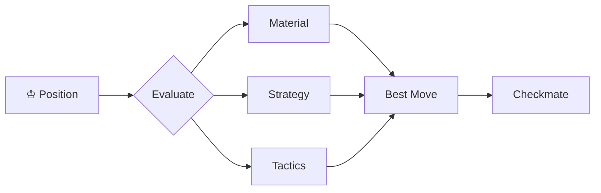

---
```sequenceDiagram
    Player->>Board: Make opening move
    Board->>Engine: Analyze position
    Engine->>Engine: Calculate best variation
    Engine->>Player: Suggest best move
    Player->>Board: Play tactical move
    Board->>Opponent: Deliver challenge
    Opponent->>Engine: Search defense
    Engine->>Player: Evaluate outcome
```
---
---

# 📜 Favorite Quote

> *"The important thing is not to stop questioning. Curiosity has its own reason for existing."*  
> — Albert Einstein

---
